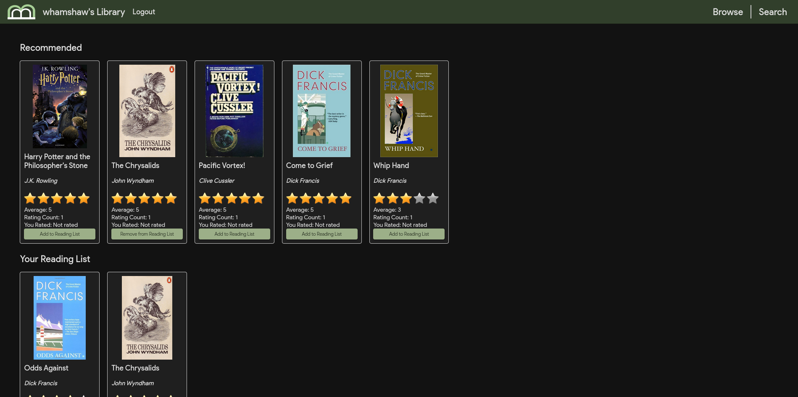
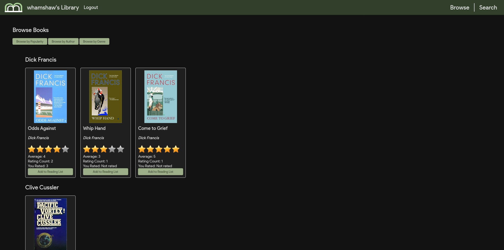

# BrilliantBooks

Books are a uniquely portable magic.

## Overview

BrilliantBooks is a web application that allows users to discover books and curate a reading list. Users can search for books and authors that they know, or browse for books by author, genre, or popularity.


## Features

- **Search**: Users can search for books and authors.
- **Browse**: Users can browse books by author, genre, or popularity.
- **Reading List**: Users can add books to their personal reading list and remove them as needed.
- **Ratings**: Users can rate books and see average ratings.

## Screenshots

### Home Screen


### Browse Tab


## Setup and Installation

Follow these steps to set up and install BrilliantBooks:

### Prerequisites

- Python 3.x
- pip (Python package installer)
- virtualenv (optional but recommended)

### Installation

1. **Clone the repository**:

    ```sh
    git clone https://github.com/whamshaw/brilliantbooks.git
    cd brilliantbooks
    ```

2. **Create and activate a virtual environment** (optional but recommended):

    ```sh
    python -m venv venv
    source venv/bin/activate
    ```

3. **Install the required packages**:

    ```sh
    pip install -r requirements.txt
    ```

4. **Apply database migrations**:

    ```sh
    python manage.py makemigrations
    python manage.py migrate
    ```

5. **Create a superuser** (optional, for accessing the Django admin interface):

    ```sh
    python manage.py createsuperuser
    ```

6. **Run the development server**:

    ```sh
    python manage.py runserver
    ```

7. **Access the application**:

    Open your web browser and go to `http://127.0.0.1:8000/`.

## Usage

- **Search for Books and Authors**: Click the "Search" button in the top right to pop out the search bar. The search results will match both books and authors.
- **Browse Books**: Use the "Browse" button in the top navigation to browse books.
- **Manage Reading List**: Add books to your personal reading list by clicking the "Add to Reading List" button. Remove books from your reading list by clicking the "Remove from Reading List" button. Simple.
- **Rate Books**: Rate books using the star rating system.